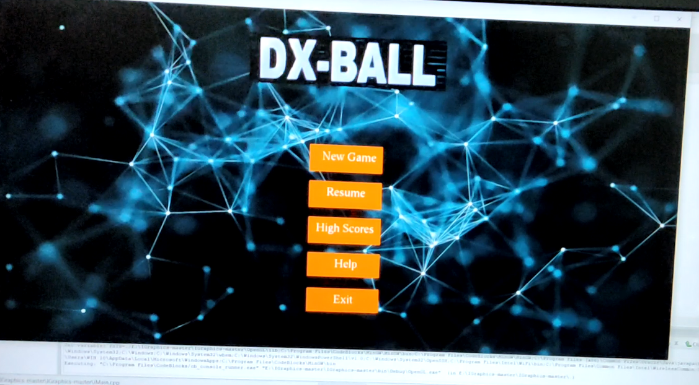
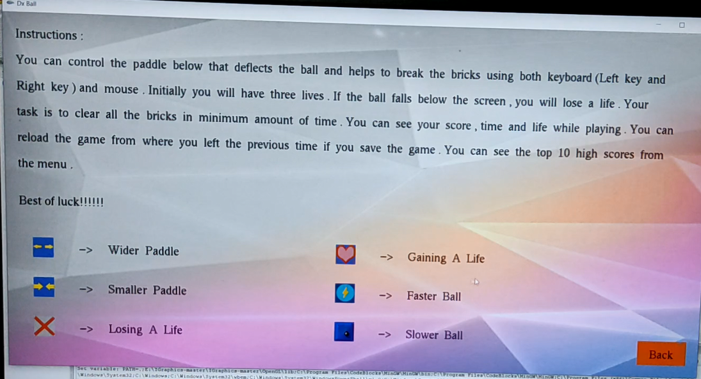
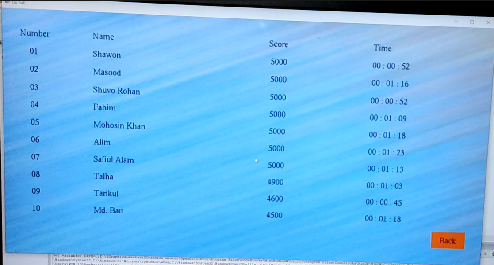
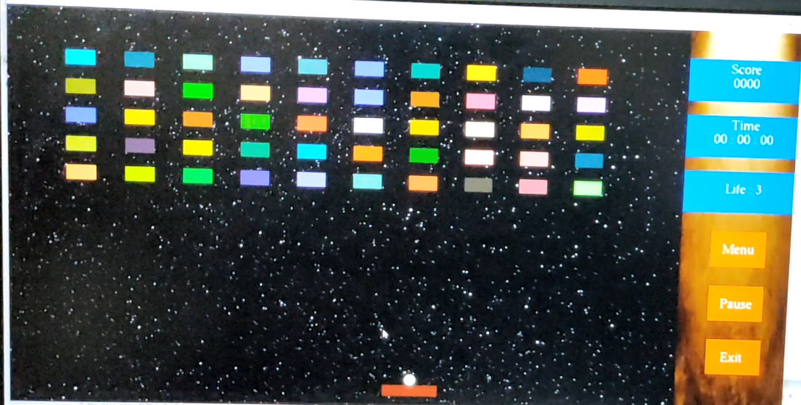

# DX-Ball Game

This project is an implementation of the classic **DX-Ball game** using the **iGraphics library** in the C programming language. It features exciting gameplay with enhanced functionalities and additional perks. Here is the [Youtube Link](https://youtu.be/pI7ulg6F__I)

## Game Overview
- The player controls a paddle at the bottom of the screen to deflect a ball, hitting colored blocks at the top.
- The paddle can be operated using both **keyboard** and **mouse**.
- The game ends when all blocks are cleared (win) or the ball falls below the paddle (loss).
- Players have an initial set of **three lives**, and the ball speed increases gradually over time.
- The game tracks **time**, **points**, and **remaining lives**, all displayed during gameplay.

## Features
### Base Functionality
- A **menu page** with options to:
  - Start a new game.
  - Resume the last game.
  - View the **top-10 high scores**.
  - Exit the game.
- A **prompt to save the player’s name** when the game ends (win or loss).
- **Pause and exit functionality** during gameplay.
- Reload the game from the last unfinished session.

### Perks and Items
- Different block hits may trigger special **perks** or **damage** items:
  - **Perks**:
    - Extra life.
    - Slower ball speed.
    - Wider paddle.
  - **Damages**:
    - Losing life.  
    - Shrinking paddle.
    - Faster ball speed.

### Enhanced Functionalities
- **Help menu** to explain gameplay and controls.
- **Music and sound effects** to enhance the gaming experience.
- Dynamic transitions between **menu**, **gameplay**, and **high score pages**.

## How to Play
- Use the keyboard or mouse to control the paddle.
- Aim to clear all blocks in the shortest time possible.
- Avoid letting the ball fall below the paddle.
- Use perks and avoid damage items to maintain an advantage.

## Images

    
    
    
    

